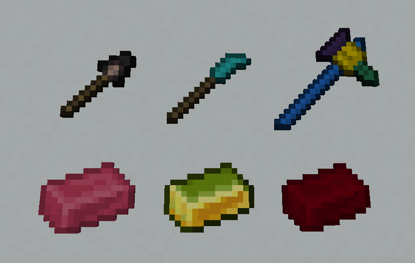

 

### Download on Curseforge: https://www.curseforge.com/minecraft/mc-mods/tinkers-delight

This mod is an add-on to Tinkers' Construct for 1.16 and adds new weapons, materials, and traits.

## Weapons
* **Mace** - Bonks enemies with increased knockback.
* **Naginata** - It's a knife on a long stick.
* **War Hammer**  - Powerful but slow. Right-click the ground to blast enemies away. Compatible with other abilities and upgrades:
   * Haste: reduced cooldown
   * Blasting: increased height
   * Knockback: increased distance
   * Range: increase AOE

## Materials
Three new materials, all created with the Tinkers Smeltery. Alas poor Yorick, you'll need to use JEI to discover them and learn their recipes.

## Traits
* **Liftoff** - Knocks nearby enemies up, up, and away when you strike the ground with it.
* **Vengeful** - The more kills you make with a tool, the higher the attack damage bonus.

## Configurations
- `vengefulDamageCap` applies a cap to the damage bonus for a weapon with Vengeful trait. Default is 0 (no cap).

## Mod issues
Please log any issues or feature requests on the [Gitlab issue tracker](https://gitlab.com/chirptheboy/tinkers-delight/-/issues).

## Modpack makers
- Feel free to include this in your modpacks

## Special thanks
- [Slimeknights](https://github.com/SlimeKnights/) - Authors of [Tinkers Construct](https://www.curseforge.com/minecraft/mc-mods/tinkers-construct) and [Mantle](https://www.curseforge.com/minecraft/mc-mods/mantle)
- [Princess of Evil](https://www.curseforge.com/members/princessofevil/projects) - For code references