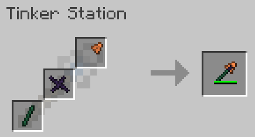

 

### Download on Curseforge: https://www.curseforge.com/minecraft/mc-mods/tinkers-delight

This mod is an add-on to Tinkers' Construct for 1.16, and is a work-in-progress. It currently adds a new weapon, three new materials, and one new trait.

## Weapons
**Mace** - Bonks enemies with increased knockback. Requires a mace head, tool handle, and tool binding.

## Materials
Three new materials, all created with the Tinkers Smeltery. Alas poor Yorick, you'll need to use JEI to discover them and learn their recipes.

## Traits
**Vengeful** - The more kills you make with a tool, the higher the attack damage bonus.

## Mod issues
Please log any issues or feature requests on the [Gitlab issue tracker](https://gitlab.com/chirptheboy/tinkers-delight/-/issues).

## Modpack makers
- Feel free to include this in your modpacks

##Special thanks
- [Slimeknights](https://github.com/SlimeKnights/) - Authors of [Tinkers Construct](https://www.curseforge.com/minecraft/mc-mods/tinkers-construct) and [Mantle](https://www.curseforge.com/minecraft/mc-mods/mantle)
- [Princess of Evil](https://www.curseforge.com/members/princessofevil/projects) - For code references